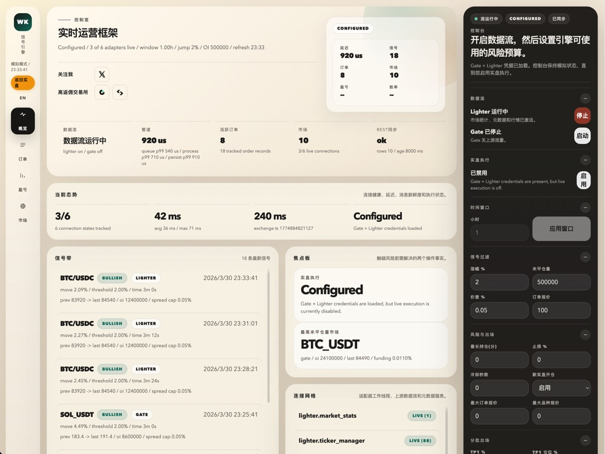
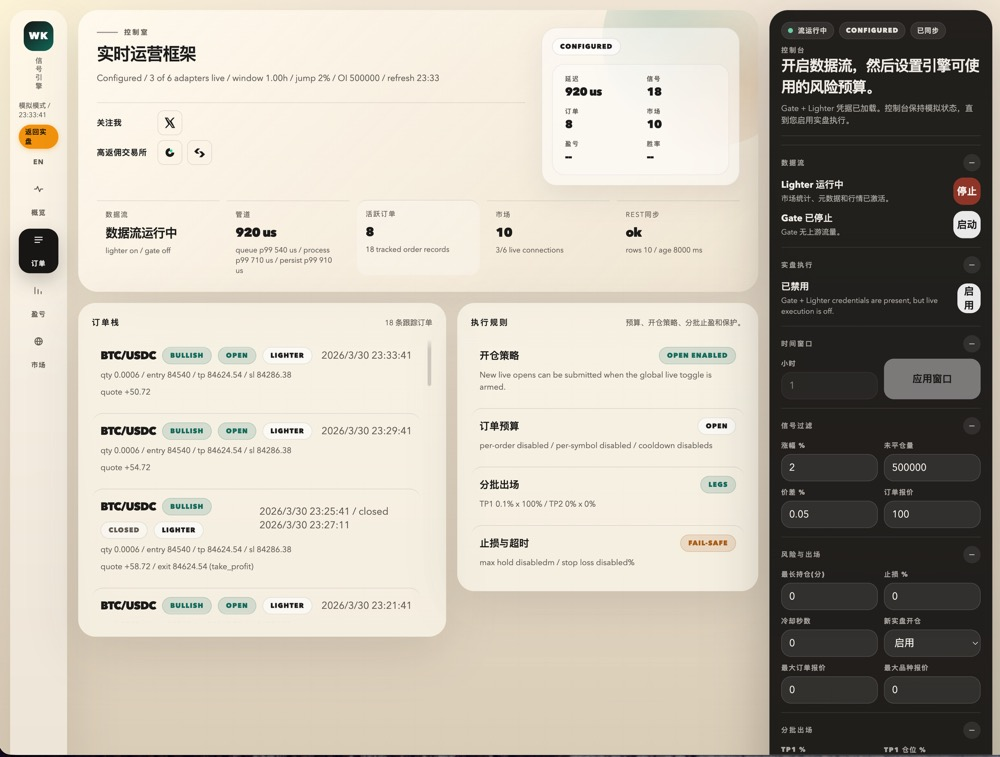
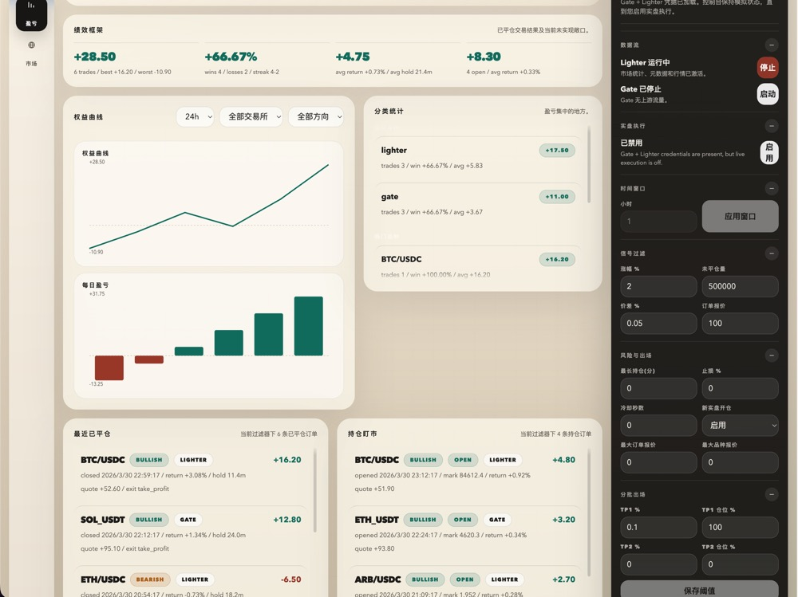
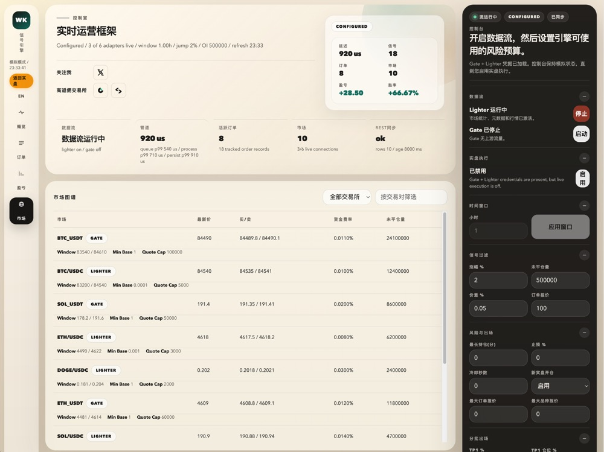
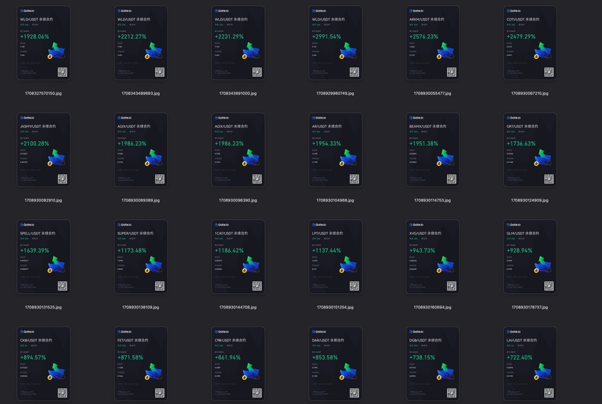
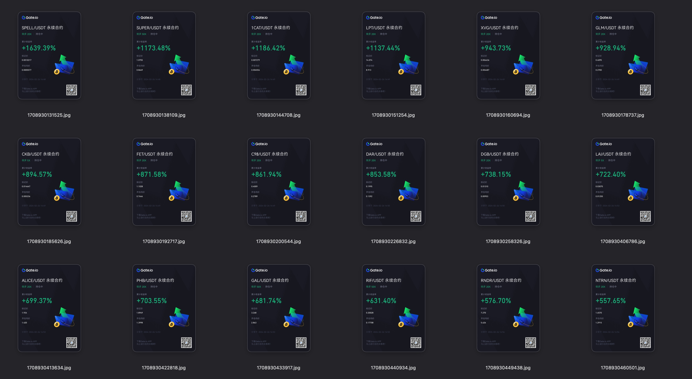
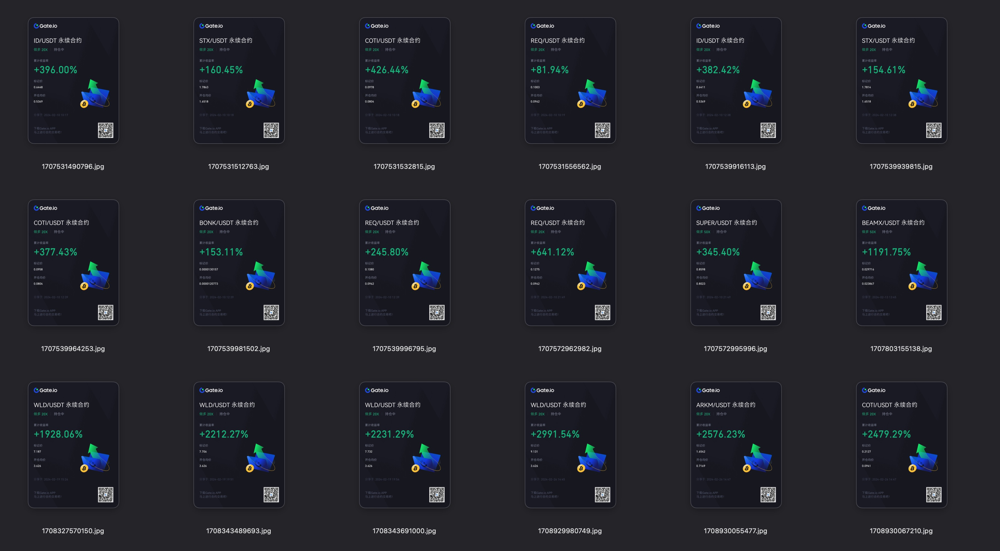

# Crypto-trading-Hunter

中文 | [English](README_en.md)

[](LICENSE)


> 基于 Rust 的低延迟永续合约交易机器人，支持 Lighter 链上 DEX 和 Gate.io。
> 核心策略「**启动币抓手**」：实时监控全市场，捕捉短时间内快速突破的代币——那些最终涨 30%、40% 的大行情，都是从这一刻开始的。

---

## 截图

### 仪表盘

<p align="center">
  
  
</p>
<p align="center">
  
  
</p>

### 历史订单收益

> ⚠️ **重要说明**：以下收益记录均来自**上一轮牛市初期**的实盘交易，彼时山寨季动量充沛，策略命中率较高。
>
> **请勿在熊市或震荡市中使用相同参数运行实盘。** 动量追趋策略在单边上涨行情中效果最佳，熊市中假突破频发，止损频率将大幅上升。
>
> 建议在**牛市启动信号明确或山寨季来临**时再运行此机器人进行实盘交易。**目前仅供学习与技术交流使用。**
>
> 历史表现不代表未来收益。

<p align="center">
  
</p>
<p align="center">
  
</p>
<p align="center">
  
</p>

---

## 项目简介

**Crypto-trading-Hunter** 通过 WebSocket 实时订阅 [Lighter](https://lighter.xyz) 永续合约 DEX 和 Gate.io 的全市场行情，基于滑动时间窗口检测价格突破信号，支持模拟交易和实盘交易，并在本地 `http://127.0.0.1:3000` 提供一个 Web 仪表盘进行全程监控。

核心设计目标是**低延迟**：信号热路径与持久化、UI 快照严格解耦，`process p99` 稳定在几十微秒级。

---

## 功能特性

- **双交易所接入**：Lighter 链上永续 DEX + Gate.io，通过 WebSocket 实时订阅
- **实时 BBO 追踪**：持续追踪所有活跃永续合约的最优买卖价与深度
- **价格突破信号**：基于滑动时间窗口的多空信号检测，全部参数可在仪表盘实时调整
- **模拟交易**：双档止盈 + 止损 + 最大持仓时间，自动开平仓，结果持久化
- **实盘交易**：支持 Gate.io 和 Lighter 实盘下单，内置多层风控参数
- **Web 仪表盘**：实时展示行情、信号历史、订单状态、连接状态与延迟指标
- **SQLite 持久化**：信号与订单历史本地落库，支持跨重启保留
- **Docker 部署**：提供 Dockerfile 与 Docker Compose，开箱即用

---

## 策略逻辑：启动币抓手 / Momentum Hunter

### 核心观察

市场上每天都有涨幅 30%、40% 的代币，但这些大行情不会凭空出现——它们必然先经历 5%、10%、15% 的积累过程。

**策略的本质是：在动量刚刚启动的早期阶段入场，而不是在行情已经明显的时候追高。**

### 信号触发

当某个永续合约在短时间窗口内从低点**快速上涨达到阈值**（例如 15%），视为拉盘行情启动信号：

- 短时间内大幅上涨，说明有强烈的买方力量介入
- 价格刷新了窗口高点，确认动量方向
- 同时验证持仓量和价差，过滤低流动性或异常市场

满足以下所有条件时触发多头信号：

1. 当前价从窗口低点的涨幅 ≥ `price_jump_threshold_pct`（首次突破，前一 tick 尚未达到）
2. 当前价即为窗口内最高价（确认动量方向）
3. 持仓量 > `open_interest_threshold`（过滤低流动性市场）
4. 买卖价差 ≤ `spread_threshold_pct`（确保能以合理价格成交）

**空头信号（Bearish）** 逻辑对称：短时间内从窗口高点快速下跌，视为砸盘行情启动，做空追势。

### 出场策略

信号触发后，机器人自动建仓，支持两种出场思路：

**方案一：双档止盈（推荐思路）**
- 第一档止盈（`sim_take_profit_pct`）：快速止盈2%，你就平仓98%，留下2%的仓位因为这部分都是利润（`sim_take_profit_ratio_pct`）
- 第二档止盈（`sim_take_profit_pct_2`）：以利润作为剩余仓位继续持有，等待更大的行情（吃30%~40%的涨幅）

**方案二：小止盈出局（剥头皮）**
- 将第一档止盈比例设为 100%，直接全出，快速锁定利润。

### 止损策略

支持两种止损方式，可同时使用：

- **固定止损**（`sim_stop_loss_pct`）：价格反向到达止损线时立即平仓
- **时间止损**（`max_hold_minutes`）：超过最大持仓时间仍未止盈，说明动量已消退，自动平仓离场

- 自己可以研究适合自己的玩法～上面提到的也只是一些我的思路。
---

## 架构概览

```
WebSocket 行情流（Lighter / Gate.io）
        │
        ▼
  事件队列（Tokio channel）
        │
        ▼
  状态机热路径（app.rs）
  ├── 滑窗更新
  ├── 信号判断
  └── 模拟 / 实盘订单决策
        │
   ┌────┴────┐
   ▼         ▼
持久化队列  读模型 Worker（定时采样）
（SQLite）        │
                  ▼
           /api/snapshot ◄── Web 仪表盘轮询
```

热路径不同步等待 SQLite 写入；UI 快照由旁路 Worker 定时生成，避免锁竞争影响信号延迟。

---

## 快速开始

### 前置要求

- [Rust](https://rustup.rs/)（本地开发）
- [Docker Desktop](https://www.docker.com/products/docker-desktop/)（容器部署）
- Python 3 + [lighter-python](https://github.com/elliottech/lighter-python)（仅 Lighter 实盘交易需要，Docker 镜像已内置）

### 本地运行

```bash
cargo run
```

打开浏览器访问：`http://127.0.0.1:3000`

### Docker

```bash
# 构建镜像
docker build -t lighter-rust-bbo:local .

# 运行容器
docker run --rm --env-file .env -p 3000:3000 lighter-rust-bbo:local
```

### Docker Compose（推荐）

```bash
cp .env.example .env
# 按需编辑 .env 填入交易所密钥
docker compose up --build
```

---

## 环境变量

复制 `.env.example` 为 `.env`，仅实盘交易需要填写密钥；纯行情监控和模拟交易无需任何密钥。

| 变量 | 说明 | 场景 |
|------|------|------|
| `GATE_API_KEY` | Gate.io API Key | Gate 实盘 |
| `GATE_API_SECRET` | Gate.io API Secret | Gate 实盘 |
| `LIGHTER_ACCOUNT_INDEX` | Lighter 账户索引 | Lighter 实盘 |
| `LIGHTER_API_KEY_INDEX` | Lighter API Key 索引（须 > 3） | Lighter 实盘 |
| `LIGHTER_API_PRIVATE_KEY` | Lighter API 私钥 | Lighter 实盘 |

> **安全提示**：`.env` 已被 `.gitignore` 排除，永远不要将真实密钥提交到仓库。

---

## 技术栈

| 层级 | 技术 |
|------|------|
| 语言 | Rust 2024 edition |
| 异步运行时 | Tokio |
| Web 框架 | Axum |
| WebSocket | tokio-tungstenite |
| HTTP 客户端 | reqwest（rustls-tls） |
| 数据库 | SQLite（rusqlite bundled） |
| 序列化 | serde / serde_json |
| 日志 | tracing / tracing-subscriber |
| Lighter 签名桥 | Python 3 + lighter-python |
| 部署 | Docker / Docker Compose |

---

## 注意事项

1. **密钥安全**：`.env` 文件已被 `.gitignore` 排除，切勿将真实密钥提交到任何公共仓库
2. **先跑模拟，再开实盘**：本项目内置模拟交易功能，不需任何 API 密鑰即可体验完整的信号检测、开平仓、盘盈与盘亏流程。**强烈建议在开实盘之前先跑模拟模式，充分理解机器人的行为和策略特性，以免因对系统不熟悟造成不必要的损失。**
3. **Lighter API Key Index**：`LIGHTER_API_KEY_INDEX` 必须大于 3，否则启动时会校验失败
4. **Python 依赖**：仅 Lighter 实盘交易需要 lighter-python SDK；使用 Docker 部署时已内置，无需手动安装
5. **网络稳定性**：WebSocket 订阅依赖稳定的网络，断线会自动重连，但建议在网络质量较好的环境下运行
6. **资金规模**：初次使用实盘时建议从小额开始，熟悉系统行为后再逐步加仓

---

## 常见问题

**Q：不会 Rust 也能用吗？**
A：可以。通过 Docker Compose 部署无需任何编程知识，按照快速开始步骤操作即可。

**Q：模拟交易和实盘有什么区别？**
A：模拟交易仅记录信号和假设的订单结果，不会真实下单，无需配置任何 API 密钥。实盘模式需要填写对应交易所的密钥，并在仪表盘中手动开启。

**Q：Lighter 是什么交易所？**
A：[Lighter](https://lighter.xyz) 是一个基于以太坊 Layer 2 的链上永续合约 DEX，资产由智能合约托管，非中心化交易所。

**Q：信号触发了但没有实际下单，正常吗？**
A：正常。信号触发和实盘下单是两个独立开关。默认状态下只运行模拟交易，需在仪表盘中开启「实盘交易」并允许开仓后才会真实下单。

**Q：仪表盘参数调整后会立即生效吗？**
A：是的，所有阈值参数（窗口时长、涨幅阈值、止盈止损等）在仪表盘调整并保存后立即对新信号生效，同时持久化到本地数据库，重启后自动恢复。

---

## 免责声明

本项目仅供学习与技术研究使用。加密货币交易存在极高风险，可能导致本金全部损失。本项目不构成任何投资建议。使用本软件进行实盘交易所产生的一切盈亏风险由使用者自行承担，作者不承担任何法律或财务责任。

---

## 关于作者

- **X / Twitter**：[@TraderX548826](https://x.com/TraderX548826)

如果你在找返佣交易所，欢迎通过以下链接注册：

- [Gate.io](https://www.gateport.business/share/avuwuwte)
- [Bitget](https://partner.hdmune.cn/bg/mcqta56y)

---

## License

[MIT](LICENSE) © 2026 WooKiao
